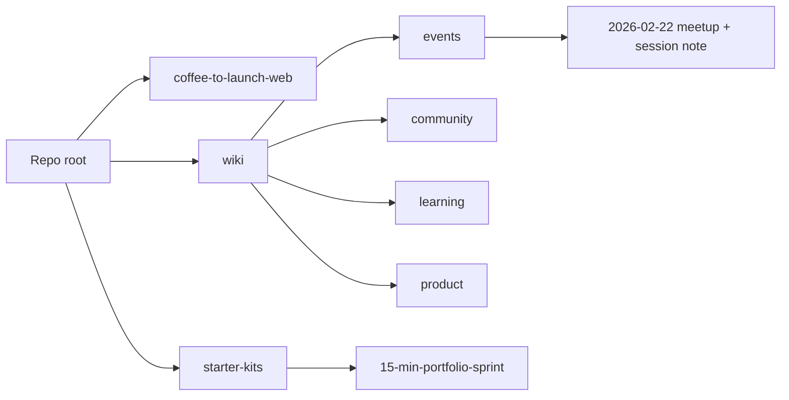

# Second brain monorepo setup

## Current state

- **Root**: [README.md](README.md), [.gitignore](.gitignore), [coffee-to-launch-web/](coffee-to-launch-web/) (Next.js meetup site), [starter-kits/](starter-kits/) (already present).
- **starter-kits/**: Contains **15-min-portfolio-sprint** (first starter kit). Add README to document it and how to add more.
- **Context**: First meetup on Eventbrite (Coffee to Launch co-working meetup, Sun Feb 22 2026, 10am–2pm, State Library Victoria, Melbourne). First session notes in Downloads: "Building Code Prototypes with AI" (Gemini summary + decisions). Long-term: experiment towards identic AI (personal agents as in the [HBR IdeaCast](https://hbr.org/podcast/2026/02/with-rise-of-agents-we-are-entering-the-world-of-identic-ai)).

## 1. Wiki structure

Create a **wiki** at repo root with categories and a single entry point:

- **wiki/README.md** — Index: short description of the wiki and links to each category.
- **wiki/events/** — Meetup dates, Eventbrite links, session summaries.
- **wiki/community/** — People, roles, channels, norms.
- **wiki/learning/** — Resources, tool stacks, how-to notes.
- **wiki/product/** — Roadmap, ideas, runbooks for the meetup/product side.

Use plain Markdown so Cursor (and future tooling/agents) can navigate by links and paths. No extra tooling required.

## 2. Seed wiki with first event and session notes

- **wiki/events/2026-02-22-coffee-to-launch-coworking.md** — First meetup: Eventbrite link, date/time, venue (State Library Victoria, Melbourne), one-line description. Add a "Sessions" section that links to the first session note.
- **wiki/events/2026-02-22-building-code-prototypes-with-ai.md** — First session: title, date, link to Eventbrite event; paste in the **Summary** and **Details / Decisions** (and optionally "Suggested next steps") from [Building Code Prototypes with AI - 2026_02_22 11_01 AEDT - Notes by Gemini.md](/Users/olysu/Downloads/Building Code Prototypes with AI - 2026_02_22 11_01 AEDT - Notes by Gemini.md). Trim or anonymise links (e.g. transcript/recording) as you prefer; keep content that’s useful for future reference and for an identic-AI-style context later.

Optionally add minimal placeholders in the other categories so the index has a target for each:

- **wiki/community/README.md** — "People, roles, and communication (Slack, etc.)."
- **wiki/learning/README.md** — "Resources and tool stacks (Cursor, Claude, Gemini, etc.)."
- **wiki/product/README.md** — "Roadmap and runbooks for the meetup."

## 3. Starter-kits area (already present)

- **starter-kits/** already exists and contains **15-min-portfolio-sprint**.
- Add **starter-kits/README.md** with:
  - Purpose: host open-source starter kits (and similar repos) as submodules or nested clones.
  - List **15-min-portfolio-sprint** with a one-line description (e.g. portfolio template / sprint kit from the meetup).
  - How to add more: `git submodule add <url> starter-kits/<name>` and clone/update with `git submodule update --init --recursive`.

## 4. Root README and identic AI

- Update [README.md](README.md) to:
  - Describe the repo as a **second brain** for launching the Coffee to Launch co-working meetup community.
  - List: **coffee-to-launch-web** (Next.js site), **wiki** (internal notes: events, community, learning, product), **starter-kits** (e.g. 15-min-portfolio-sprint; add more via submodules).
  - Keep existing "Development" instructions for the web app.
  - Add a short "Future" line: experiment towards identic AI (personal agents; link to HBR podcast or a wiki note that explains the direction).

## 5. AGENTS.md for AI agent guidance

Add **AGENTS.md** in two places so AI agents know what to do:

- **Root [AGENTS.md](AGENTS.md)**  
  - Purpose: this repo is a "second brain" monorepo for the Coffee to Launch co-working meetup community.  
  - Structure: **coffee-to-launch-web** (Next.js site), **wiki** (internal notes: events, community, learning, product), **starter-kits** (e.g. 15-min-portfolio-sprint; more added as submodules).  
  - Conventions: wiki is plain Markdown by category; starter kits live under starter-kits/ with instructions in starter-kits/README.md.  
  - Include a **Learned User Preferences** section with: *When starting new projects, add AGENTS.md to guide AI agents and README.md to guide humans.*
- **[coffee-to-launch-web/AGENTS.md](coffee-to-launch-web/AGENTS.md)**  
  - Purpose: Next.js app for the meetup (Coffee to Career / Coffee to Launch site).  
  - Tech stack and scripts (see package.json).  
  - Where key code lives (e.g. src/app, src/components).  
  - That this package is part of the monorepo and wiki/starter-kits live at repo root.

Use plain bullet points and short guidance; no evidence tags or process metadata (per continual-learning style).

## 6. .gitignore

No change needed for the wiki (plain Markdown). If you later add tooling that writes under wiki (e.g. cache or build output), add those paths then.

## 7. Additional starter kits

**15-min-portfolio-sprint** is already in **starter-kits/**. When adding more, use `git submodule add <url> starter-kits/<name>` and document each in **starter-kits/README.md**.

---

## Resulting layout

- **wiki**: categories + index + first event and first session notes in-repo.
- **starter-kits**: already contains 15-min-portfolio-sprint; add README and document how to add more.
- **README**: frames the monorepo as second brain and points to identic AI as future direction.
- **AGENTS.md**: at root (monorepo + preference: new projects get AGENTS.md + README.md) and in coffee-to-launch-web (app context for AI agents).

